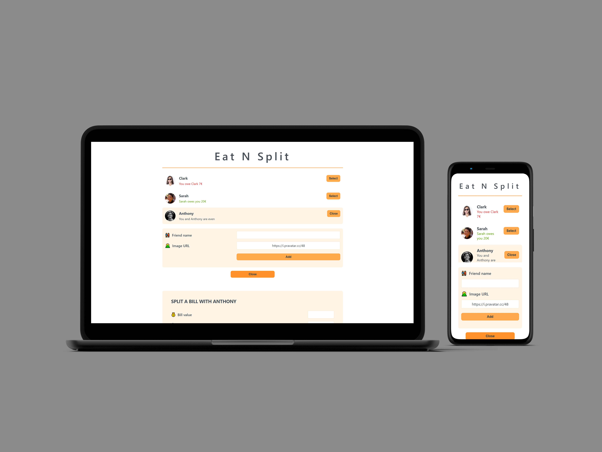

# **Eat n Split: Bill Splitting App**

## **Table of content:**

-   [Description](#description)
-   [Key Features](#key-features)
-   [Project Structure](#project-structure)
-   [Technical Highlights](#technical-highlights)
-   [Conclusion](#conclusion)

**Live demo** [click here](https://eat-n-split-bill-app.netlify.app/)



---

### **Description:**

Eat n Split is a React-based application that simplifies the process of splitting bills with friends. Users can add friends with their names and images, and easily calculate who owes whom after sharing a meal or expense. The app is designed to practice state management and toggling between components on a single-page interface.

---

### **Key Features:**

1. **Add Friends:**

    - Users can add friends by providing a name and an image.
    - Friends are displayed in a dynamic list.

2. **Split the Bill:**

    - Select a friend from the list to split the bill.
    - Fill out a form to input:
        - **Bill Value**: Total bill amount.
        - **User’s Expense**: Amount paid by the user.
        - **Friend’s Expense**: Amount paid by the friend.
        - **Who’s Paying**: Select whether the user or the friend is paying the bill.

3. **Expense Overview:**

    - After splitting the bill, the friend list shows:
        - **Amount Owed:** If the friend owes the user.
        - **Amount to Pay:** If the user owes the friend.
        - **Even Status:** If both parties are settled.

4. **Single-Page Functionality:**
    - Efficient toggling between different windows (e.g., adding friends and splitting bills) on a single-page interface.

---

### **Project Structure:**

```
src
├── components
│   ├── Button.js          # Reusable button component for actions
│   ├── FormAddFriend.js   # Handles the form to add new friends
│   ├── FormSplitBill.js   # Handles the form to input bill details and split expenses
│   ├── Friend.js          # Displays individual friends with expense status
│   ├── Friends.js         # Displays friends list
│   ├── Input.js           # Reusable input field component
├── App.js                # Root component organizing the application layout
├── index.css             # Global styling for the application
├── index.js              # Entry point for rendering the React app

```

---

### **Technical Highlights:**

-   **React Features:**

    -   State management to handle dynamic data (friends, bills, and expenses).
    -   Conditional rendering and state-driven toggling for switching between windows.

-   **User-Friendly Design:**
    -   Clear and intuitive interface for adding friends and managing expenses.

---

### **Conclusion:**

Eat n Split is a functional and interactive application that effectively demonstrates state management and dynamic component rendering in React. With its clean interface and practical use case, it serves as an excellent project for mastering React fundamentals.
